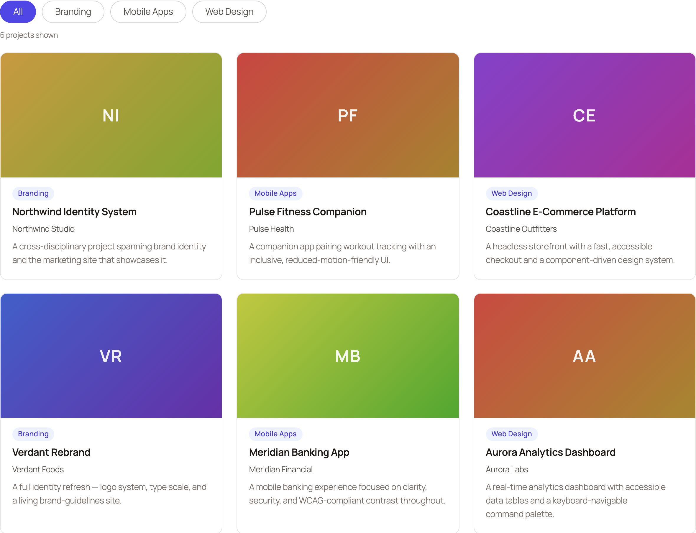

# Featured Work: a dynamic WordPress Gutenberg block

An accessible, filterable grid of case studies, built as a single self-contained WordPress plugin. It's a **dynamic Gutenberg block** backed by a custom post type, taxonomy, and post meta. The block renders on the server in PHP, is configured through a **React** editor, and becomes interactive on the front end with **framework-free** JavaScript and CSS.



Built from scratch as a code sample to demonstrate a full-stack WordPress and Gutenberg workflow.

## What it demonstrates

| Area | Where to see it |
| --- | --- |
| Semantic HTML | `src/render.php`: `<article>`, `<figure>`, `<ul role="list">`, proper headings |
| Custom CSS, no framework | `src/style.scss`: CSS Grid, container queries, design tokens |
| Design & QA | The card design, type scale, spacing, hover and focus states |
| JavaScript, no jQuery | `src/view.js`: the accessible filter (WAI-ARIA toolbar) |
| React | `src/edit.js`: `InspectorControls` plus a live `ServerSideRender` preview |
| WordPress / PHP | CPT, taxonomy, meta box, and the dynamic `WP_Query` renderer |
| Gutenberg block editor | `block.json` (API v3), dynamic block, editor controls |
| Accessibility | Roving-tabindex filter, `aria-pressed` and `aria-live`, focus-visible, reduced-motion |

## Requirements

- **Node.js** 18+ and npm
- **Docker**, for the recommended `wp-env` setup. A Docker-free `wp-now` path is below.

## Quick start (wp-env, recommended)

```bash
npm install
npm run build
npm run env:start
```

Then open:

- **Front-end demo:** http://localhost:8888/our-work/
- **Editor and admin:** http://localhost:8888/wp-admin, with user `admin` and password `password`

On activation the plugin seeds **6 demo case studies** across 3 project types and creates the **"Our Work"** page containing the block. Pretty permalinks are enabled automatically, so the demo URL works out of the box.

Stop the environment with `npm run env:stop`.

## Quick start (wp-now, no Docker)

```bash
npm install
npm run build
npx @wp-now/wp-now start
```

`wp-now` boots WordPress with this plugin activated, so the seeding runs. Open the URL it prints and visit `/our-work/`. If that returns a 404, set **Settings, Permalinks, Post name** once.

## What to look for

- **A real dynamic block.** The block saves no markup (`save` returns `null`); every render runs a fresh `WP_Query` in `render.php`.
- **The editor experience.** Insert or select the block and open the sidebar: change **columns** and **count**, pick a **project type** (loaded live from the taxonomy over REST), and watch the `ServerSideRender` preview update.
- **The accessible filter.** On `/our-work/`, use the filter bar with a **keyboard**: `Tab` reaches the toolbar, arrow keys move between filters (roving tabindex), and `Enter` applies one. The result count is announced through an `aria-live` region.
- **Whole-card link and focus.** Each card is clickable anywhere (a single stretched link), and tabbing to it shows a visible focus ring.
- **Responsiveness.** The grid uses **container queries**, so it reflows to the block's own width (three columns down to one). Resize the window, or drop the block into a narrow column, to see it.
- **Escaping and data flow.** `render.php` escapes all output and resets the global query; the client name comes from a secured meta box.

## Architecture and key decisions

- **Dynamic, not static.** A dynamic block (server-rendered via `render.php`) reflects the live database on every request and never suffers block-validation errors, which suits content that changes independently of the page.
- **Self-contained data layer.** The plugin registers its own `case_study` CPT, `project_type` taxonomy, and client and URL post meta (with a nonce-protected meta box), then seeds demo content on activation, so the sample runs with no manual setup.
- **`ServerSideRender` for editor parity.** The editor preview calls the same PHP renderer as the front end, so what you see in the editor is what publishes.
- **No framework.** The front-end filter is plain JavaScript and the styling is hand-written SCSS with design tokens, with no CSS or JS framework. The only React is Gutenberg's own editor layer.
- **Accessibility first.** The filter implements the WAI-ARIA toolbar pattern, the card link uses an accessible "stretched link", focus states are visible, and motion respects `prefers-reduced-motion`.

## Accessibility notes

- Filter bar is a `role="toolbar"` with **roving tabindex** and arrow, Home, and End navigation.
- Active filter reflected with `aria-pressed`; result count announced via `role="status"` and `aria-live`.
- One meaningful link per card (stretched link) rather than several competing links.
- Visible `:focus-visible` rings on the card and the filter buttons.
- Decorative gradient placeholders are `aria-hidden`; images carry alt text.
- Progressive enhancement: every card is visible with JavaScript disabled.

## Project structure

```
featured-work.php        Plugin bootstrap: constants, requires, block and activation hooks
inc/
  post-types.php         Registers the case_study custom post type
  taxonomies.php         Registers the project_type taxonomy
  meta.php               Client and project URL meta, meta box, secure save
  seed.php               Seeds demo content and the "Our Work" page on activation
src/
  block.json             Block metadata (API v3), attributes, supports, assets
  index.js               Block registration
  edit.js                React editor: InspectorControls and ServerSideRender preview
  save.js                Returns null (dynamic block)
  render.php             Server render: WP_Query to semantic, escaped markup
  view.js                Front-end accessible filter (no jQuery)
  style.scss             Front-end and shared styles (grid, cards, tokens)
  editor.scss            Editor-only styles
docs/
  screenshot.png         Preview image used in this README
```

Compiled output is written to `build/` by `@wordpress/scripts` and is not committed.

## Available scripts

| Script | Description |
| --- | --- |
| `npm run build` | Compile `src/` into `build/` |
| `npm run start` | The same, in watch mode |
| `npm run env:start`, `npm run env:stop` | Start and stop the local WordPress (Docker) |
| `npm run lint:js` | Lint JavaScript (WordPress config) |
| `npm run lint:css` | Lint styles (WordPress config) |
| `npm run format` | Auto-format to WordPress standards |

## Author

Built by Kasun Wijethilaka. Licensed under GPL-2.0-or-later.
